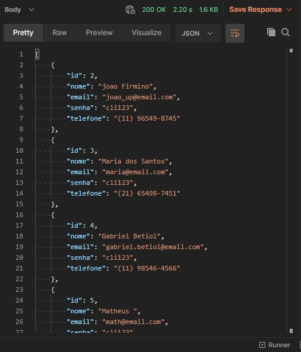
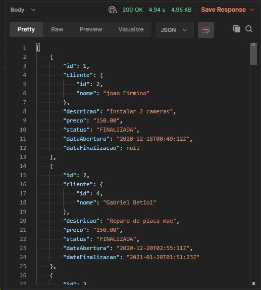

# rest-adi
Repositório para Disciplina de ADI 

REST Api de ordens de serviço desenvolvido em Java/Spring.

Banco de dados na pasta /src/main/resources.

## Rotas

### Clientes
GET - https://osworks-spring-cloud-osworks-api.azuremicroservices.io/api/clientes - GET ALL  
GET - https://osworks-spring-cloud-osworks-api.azuremicroservices.io/api/clientes/{clienteId} - GET ONE
PUT - https://osworks-spring-cloud-osworks-api.azuremicroservices.io/api/clientes/{clienteId} - UPDATE ONE
DEL - https://osworks-spring-cloud-osworks-api.azuremicroservices.io/api/clientes/{clienteId} - DELETE ONE
POST - https://osworks-spring-cloud-osworks-api.azuremicroservices.io/api/clientes - INSERT ONE
     - body: {
                "nome": <nome>,
                "senha": <senha>,
                "email": <email>,
                "telefone": <telefone>
            }

### Ordens de Serviço
GET -   https://osworks-spring-cloud-osworks-api.azuremicroservices.io/api/ordens-servico - GET ALL
GET -   https://osworks-spring-cloud-osworks-api.azuremicroservices.io/api/ordens-servico/{ordemServicoId} - GET ONE
PUT -   https://osworks-spring-cloud-osworks-api.azuremicroservices.io/api/ordens-servico/{ordemServicoId}/finalizacao - UPDATE (finaliza a O.S.)
POST -  https://osworks-spring-cloud-osworks-api.azuremicroservices.io/api/ordens-servico/{ordemServicoId} - INSERT ONE
     -  body: {
                "cliente": <clienteID>,
                "descricao": <descrição>,
                "preco": <preço>
              }
  
<table>
  <tr>
    <td></td>
    <td></td>
  </tr>
 </table>
